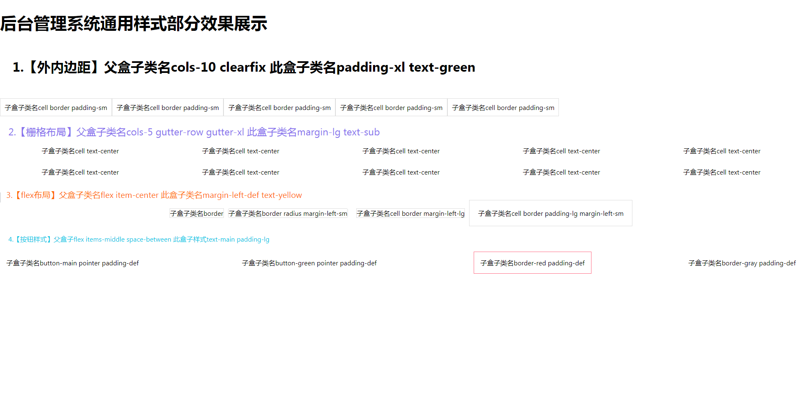

# 后台管理系统通用样式解决方案


## 一、开发后台管理系统遇到的问题

1. 开发者更关注于业务代码不太关注样式，不太考虑样式的复用性。后台管理系统在很多业务场景下都会用到，由于其面向人群的特殊性，我们一般不太关注其界面布局，样式等。

2. 大量重复样式编写，影响代码整洁度。在开发后台管理系统页面时发现，发现有很多常用样式，比如文字大小、外内边距、flex布局等等，是反复重复新建样式文件去重复编写的，就如pe管理系统【width: 200px】这个样式就在38个文件中出现100多次，【margin-left: 10px】在32个文件中出现135次,【font-size：12px/14px/16px】分别出现20/35/23次等等，代码会十分冗余。通过调研产品后台，发现一些常用样式是重复而且通用的，则可以提取出来作为公共样式进行使用，通过落地一套后台管理平台-通用样式解决方案从而提升开发页面效率。

3. 大量建立不必要less文件（其实里面可能就是设定一个盒子的外内边距或者flex布局样式）,浪费开发时间。后面codeReview代码样式写在行内里面常被diss，所以有时候只想设定一个input框宽度等于240px或者根据产品需求调整一个div的外内边距加减5px等等，不得不建立一个less文件，然后为了防止less文件类名的独立性，还得定一长串类名拼接等等，十分繁琐。

4. 不方便批量修改样式，比如颜色、文字大小、外内边距等等。

## 二、总结归纳通用样式类型

将通用样式归纳为两大模块，一个是样式通用基本模块（common.less），比如栅格布局、flex布局、清除浮动等。另一个是根据项目原型图自定义动态模块(color.js/size.js)，比如颜色，大小，内外边距等等，方便批量修改、添加和维护迭代。

1. 通用基本模块有（具体看assets/base/common.less）
* 栅格定义

    栅格定义
    默认12栅格,row表示行，cols-*表示每行多少列，cell表示单元格，c*表示大小
    举例说明：
```
// 定义cell单元格样式
.cell{position: relative;float: left;min-height: 1px}
// 表示添加类名为c1或者在父盒子类名为cols-12子盒子类名为cell的盒子宽度为12分之一
.c1,.cols-12>.c1,.cols-12>.cell {width:8.33333333%}
```
* flex布局

    将flex的属性根据功能拆分在类名里，通过自由组合类名，实现flex布局
* 位置相关样式

    盒子dispaly、position、float、overflow等属性及文字text-aligh属性
* 边框相关样式

    边框位置及形状
* 文字大小样式

    定义了从11px - 40px 11种文字大小的类名样式（按实际项目需求来）
* 清除浮动
* 其他相关样式（可以根据项目特殊性自由添加）

2. 自定义动态模块有

* 尺寸自定义模块【外内边距】（具体看assets/base/size.less）

* 颜色自定义模块【背景色,文字颜色,边框色(按钮可选)】 （具体看assets/base/color.less）

## 三、less实现自定义动态模块通用样式的设定
1. 设想：如何简洁明了通过类名来使样式生效，能够见名知其意，方便快速上手。

尺寸自定义模块【外内边距】中页面样式的使用方式，就是className = '外内边距类型-方向-大小'，举例
```
// 通过定义 @xs：5px， @xl：30px；
// className="margin-top-xs" 表示 margin-top：5px 外顶边距样式
// className="padiing-left-xl" 表示 padiing-left：30px 内左边距离样式
// className="padiing-lr-xl" 表示 padiing：0 30px 内边左右距离样式
```
颜色自定义模块【背景色,文字颜色,边框色(按钮可选)】，就是className = "类型(背景、文字、边框)-颜色"，举例
```
// 通过定义 @bg：#eff2f6及边框、文字、背景三个类型函数；
// className="boder-bg" 表示 border:1px solid @bg 边框颜色样式为#eff2f6
// className="text-bg" 表示 color: @bg 文字颜色样式为#eff2f6
// className="bg-bg" 表示 background:@bg; 背景颜色样式为#eff2f6
```

2. 以颜色自定义模块代码举例说明实现过程

* 第一步 定义颜色变量 -> 根据项目需求自由增删修改
```
@bg:#eff2f6;    // 背景色
@main:#00c6e4;  // 主色
@sub:#8a73ed;   // 辅助色
@red:#ff6d85;   // 红色
@yellow:#f60;   // 黄色
@blue:#5296ff;  // 蓝色
@green:#2c7;    // 绿色
@gray:#919191;  // 灰色
@light:#f6f6f6; // 浅灰色
@dark:#4c5355;  // 深灰色
@black:#000;    // 黑色
@white:#fff;    // 深灰色
@ccc: #cccccc;  // 深灰色
```

* 第二步 定义列表常量，方便后续递归循环生成类名对应类型对应颜色,需要用到普通变量和选择器变量
```
@colorList: @bg, @main, @sub, @red, @yellow, @blue, @green, @gray, @light, @dark, @back, @black, @white;
@colorTypeList: bg, main, sub, red, yellow, blue, green, gray, light, dark, back, black, white;
```

* 第三步 定义文字、边框、背景色函数混合方法
```
// 边框色函数
.border(@type,@color) {
    .border-@{type} {
        border:1px solid @color;
    }
    .border-light-@{type} {
        border:1px solid .light(@color);
    }
}
// 文字颜色函数
.text(@type,@color) {
    .text-@{type} {
        color:@color;
    }
}
// 背景色函数
.bg(@type,@color) {
    .bg-@{type} {
        background:@color;
    }
}
```

* 第四步 创建一个循环生成选择器的方法。Less并没有提供一个for等循环的方法，但是可以使用条件语句【when】递归的方法实现选择器的遍历，有循环就必须要有虚幻结束条件，我们就需要用到第二步的常量列表的长度、选择器名、属性值，从而获得生成选择器的名字和属性以及循环终止条件。
```
// 获取列表的长度  length(@bgcardList) 
// 获取列表元素  extract(@bgcardList, 3) 
.loopColor(@i) when (@i < (length(@colorList)+1)) {
    .border(extract(@colorTypeList, @i), extract(@colorList, @i));
    .text(extract(@colorTypeList, @i), extract(@colorList, @i));
    .bg(extract(@colorTypeList, @i), extract(@colorList, @i));
    .loopColor(@i+1);
}
```

* 第五步 调用loopColor方法，批量生成样式,切记从1调起，不是0
```
.loopColor(1);
```

最终会在css文件中生成：
```
...
.text-red { color: #ff6d85 }
.bg-red { background: #ff6d85 }
.border-red { border: 1px solid #ff6d85 }
...
```

## 四、具体使用方式
1. 全局引入'./assets/base/index.less'通用样式；
2. 直接在div上写选择器即可；
* 代码举例：

```
import React, { Component } from 'react'

export default class CssSolution extends Component {
    render() {
        return (
            <div>
                <h1>后台管理系统通用样式部分效果展示</h1>
                <h2 className="padding-xl text-green">1.【外内边距】父盒子类名cols-10 clearfix 此盒子类名padding-xl  text-green</h2>
                <div className="cols-8 clearfix">
                    <div className="cell border padding-sm">
                        子盒子类名cell border padding-sm
                    </div>
                    <div className="cell border padding-sm">
                        子盒子类名cell border padding-sm
                    </div>
                    <div className="cell border padding-sm">
                        子盒子类名cell border padding-sm
                    </div>
                    <div className="cell border padding-sm">
                        子盒子类名cell border padding-sm
                    </div>
                    <div className="cell border padding-sm">
                        子盒子类名cell border padding-sm
                    </div>
                </div>
                <div className="margin-lg text-sub h3">2.【栅格布局】父盒子类名cols-5 gutter-row gutter-xl 此盒子类名margin-lg  text-sub</div>
                <div className="cols-5 gutter-row gutter-xl clearfix">
                    <div className="cell text-center">
                        子盒子类名cell text-center
                    </div>
                    <div className="cell text-center">
                        子盒子类名cell text-center
                    </div>
                    <div className="cell text-center">
                        子盒子类名cell text-center
                    </div>
                    <div className="cell text-center">
                        子盒子类名cell text-center
                    </div>
                    <div className="cell text-center">
                        子盒子类名cell text-center
                    </div>
                    <div className="cell text-center">
                        子盒子类名cell text-center
                    </div>
                    <div className="cell text-center">
                        子盒子类名cell text-center
                    </div>
                    <div className="cell text-center">
                        子盒子类名cell text-center
                    </div>
                    <div className="cell text-center">
                        子盒子类名cell text-center
                    </div>
                    <div className="cell text-center">
                        子盒子类名cell text-center
                    </div>
                </div>
                <div className='margin-left-def text-yellow h4'>3.【flex布局】父盒子类名flex item-center 此盒子类名margin-left-def  text-yellow</div>
                <div className="flex item-center">
                    <div className="cell border">
                        子盒子类名border
                    </div>
                    <div className="cell border radius margin-left-sm">
                        子盒子类名border radius margin-left-sm
                    </div>
                    <div  className="cell border margin-left-lg">
                        子盒子类名cell border margin-left-lg
                    </div>
                    <div  className="cell border padding-lg margin-left-sm">
                        子盒子类名cell border padding-lg margin-left-sm
                    </div>
                </div>
                <div className="text-main padding-lg h5">4.【按钮样式】父盒子flex items-middle space-between 此盒子样式text-main padding-lg</div>
                <div className="flex items-middle space-between">
                    <div className="padding-def button-main pointer">
                        子盒子类名button-main pointer padding-def
                    </div>
                    <div className='padding-def button-green pointer'>
                        子盒子类名button-green pointer padding-def
                    </div>
                    <div className='padding-def border-red'>
                        子盒子类名border-red padding-def
                    </div>
                    <div className='padding-def border-gray'>
                        子盒子类名border-gray padding-def
                    </div>
                </div>
            </div>
        )
    }
}
```
部分效果展示：


